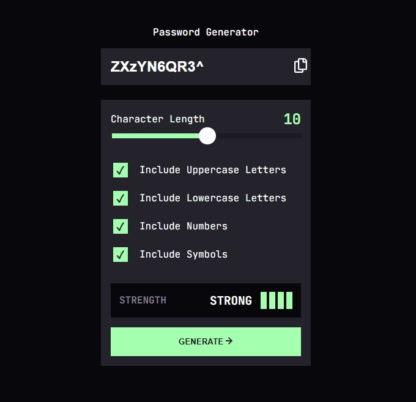

# Frontend Mentor - Password generator app solution

## Proceso

Construido con:
- Marcado semántico HTML5
- Propiedades personalizadas de CSS
- Flexbox
- CSS Grid
- Flujo de trabajo que prioriza los dispositivos móviles (Mobile-first)
- JavaScript (getElementById)

## Implementacion

Servidor alojado:

- URL alojado GIT: [https://github.com/amigos81/Password-generator-app](https://github.com/amigos81/Password-generator-app)
- URL del sitio: [https://snazzy-churros-ff8751.netlify.app/](https://snazzy-churros-ff8751.netlify.app/)

## Autor

- Edward Quisocala M. 
- Email: sis.duar@gmail.com
- Frontend Mentor - [@amigos81](https://www.frontendmentor.io/profile/amigos81)